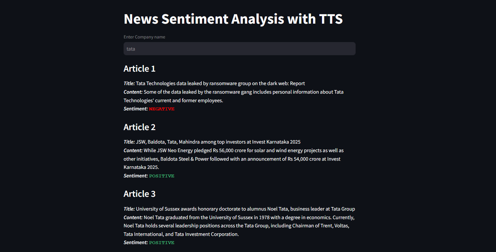
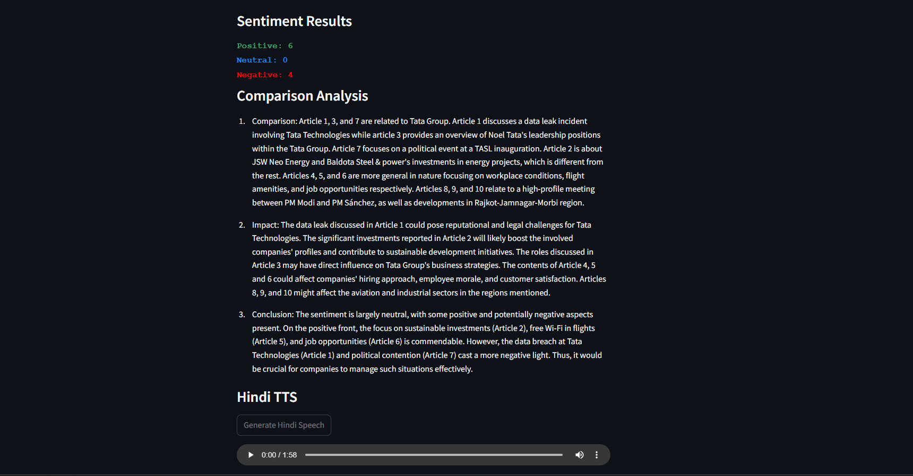

# News-Sentiment-Analysis-TTS

## About
This project is a web-based application that extracts news articles related to a given company, analyzes their sentiment, performs comparative analysis, and generates Hindi text-to-speech (TTS) output.

## Features
* News Article Extraction: Scrapes recent articles based on a given company name.
* Sentiment Analysis: Uses a pre-trained distilbert model to analyze the sentiment of each article (Positive, Neutral, or Negative).
* Comparative Analysis: Summarizes and compares multiple news articles to highlight similarities, differences, and potential impact on the company.
* Hindi Text-to-Speech: Converts the comparative analysis into Hindi speech using OpenAI's TTS API.

## Methodology
1. News Extraction:
    * scrapes latest news artcles related to the entered company.
    * extracts data including the article title, content, and date using BeautifulSoup.
2. Sentiment Analysis:
    * each article's content is analyzed using a fine-tuned distilbert sentiment analysis model.
    * sentiment is categorized as POSITIVE, NEUTRAL, or NEGATIVE and color-coded for better visualization
3. Comparative Analysis:
    * compares all articles and highlights key similarities, differences, and overall impact resulting from the comparsion.
    * OpenAI's GPT-4 is used to generate a structured comparsion.
4. Hindi Text-to-Speech (TTS):
    * comparative analysis is translated into Hindi using GoogleTranslator from deep-translator library.
    * OpenAI's TTS API, powered by the gpt-4o-mini-tts model generates Hindi Speech output.
    * output is saved as an MP3 file and made available for playback within the application.

## Tech Stack
* **BeautifulSoup:** Web scraping for news extraction
* **Hugging Face Transformers:** distilbert model for sentiment analysis
* **OpenAI API:** Backend for text analysis and speech generation
* **Deep Translator:** Translation of text from English to Hindi
* **OpenAI GPT-4:** NLP model for comparative analysis
* **OpenAI’s TTS API (gpt-4o-mini-tts):** Hindi speech synthesis
* **Streamlit:** Frontend UI framework